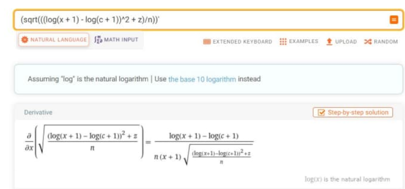

# RMSLE_for_CatBoost_Regressor
## Intro
Вот уже третий год подряд компания SIBUR организовывает собственные соревнования в областях Data Science, AI, и ML, предлагая для решения реальные кейсы основанные на реальных данных компании. В 2021 году соревнование Sibur Challenge 2021 собрало 161 участника. Задачей, поставленной перед участниками, являлось создание предикативной модели для помесячного прогнозирования объемов закупок определенного типа товаров.

## Решение задач прогнозирования
Для решения задачи прогнозирования (задача регрессии) была выбрана библиотека CatBoost разработанная компанией "Яндекс", использующая градиентный бустинг на деревьях решений. В связи с наличием большого количества категориальных признаков в предоставленных исходных данных модель CatBoostRegressor показалась наиболее удобной в работе.


## RMSLE и работа с CatBoostRegressor
Если Вы работаете в Google Collab для работы с библиотекой CatBoost необходимо установить данный пакет при помощи команды

```        
!pip install catboost

```        
Подключаем CatBoost

```        
from catboost import CatBoostRegressor

```        
Для объявления модели CatBoostRegressor необходимо вызвать ее конструктор.

```        
 model = CatBoostRegressor(iterations=3000,
                          early_stopping_rounds=100,
                          grow_policy = 'Depthwise',
                          depth=8,
                          loss_function=RMSLE(),
                          cat_features= CAT_COLS,
                          random_state=RS,
                          l2_leaf_reg = 1,
                          learning_rate=0.03,
                          verbose=10,
                          eval_metric=RMSLE_val())

```        
loss_function - параметр отвечающий за метрику ошибки при обучении модели.

eval_metric - параметр отвечающий за метрику обнаружения переобучения.

Библиотека CatBoost имеет также встроенные функции потерь. О их наличии можно ознакомиться в официальной документации :
https://catboost.ai/en/docs/concepts/loss-functions-regression

https://catboost.ai/en/docs/concepts/python-reference_catboostregressor_eval-metrics

Как можно было заметить функция RMSLE - не является встроенной в библиотеку CatBoost. Выходом из данной ситуации служат кастомные метрики, которые пользователь сам может создать для дальнейшего использования при обучении и валидации моделей. Но сначала разберемся что же такое RMSLE:

RMSLE (Root Mean Squared Log Error) - среднеквадратичная логарифмическая ошибка. Вычисляется по следующей формуле:


Вычисляя производную от данной функции получим, сложное, с вычислительной точки зрения, выражение:



Для создания собственной "кастомной метрики", необходимо представить функцию вычисляющую метрику в виде объекта. Ниже представлен код на языке Python, вычисляющий loss_function и evaluation_metric для CatBoostRegressor. Заметим, что вычисление производной было заменено на более упрощенное выражение
```
import math
class RMSLE(object):
    def calc_ders_range(self, approxes, targets, weights):
        assert len(approxes) == len(targets)
        if weights is not None:
            assert len(weights) == len(approxes)

        result = []
        for index in range(len(targets)):
            val = max(approxes[index], 0)
            der1 = math.log1p(targets[index]) - math.log1p(max(0, approxes[index]))
            der2 = -1 / (max(0, approxes[index]) + 1)

            if weights is not None:
                der1 *= weights[index]
                der2 *= weights[index]

            result.append((der1, der2))
        return result
        
class RMSLE_val(object):
    def get_final_error(self, error, weight):
        return np.sqrt(error / (weight + 1e-38))

    def is_max_optimal(self):
        return False

    def evaluate(self, approxes, target, weight):
        assert len(approxes) == 1
        assert len(target) == len(approxes[0])

        approx = approxes[0]

        error_sum = 0.0
        weight_sum = 0.0

        for i in range(len(approx)):
            w = 1.0 if weight is None else weight[i]
            weight_sum += w
            error_sum += w * ((math.log1p(max(0, approx[i])) - math.log1p(max(0, target[i])))**2)

        return error_sum, weight_sum
 ```
Теперь при работе с CatBoostRegressor model можно указывать как loss_function и eval_metric наши объекты RMSLE() и RMSLE_VAL() соответственно:

```        
 model = CatBoostRegressor(iterations=3000,
                          early_stopping_rounds=100,
                          grow_policy = 'Depthwise',
                          depth=8,
                          loss_function=RMSLE(),
                          cat_features= CAT_COLS,
                          random_state=RS,
                          l2_leaf_reg = 1,
                          learning_rate=0.03,
                          verbose=10,
                          eval_metric=RMSLE_val())
params = {'l2_leaf_reg':[1,4,8],
          'learning_rate': [0.03,0.5,0.1]
          'depth':[6,8,10]
         }
grid_search_res = model.grid_search(params, full_features['items'][FTS_COLS], full_features['items'].target, train_size=0.8)

```        
